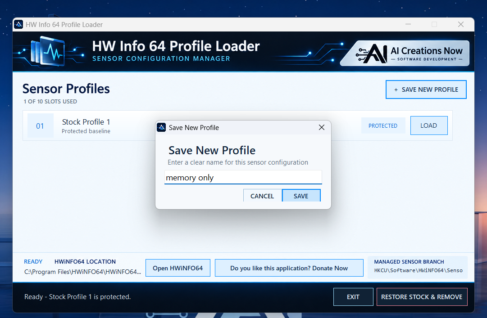

# HW Info 64 Profile Loader: save and switch sensor layouts

## Save a HWiNFO64 sensor layout

1. Obtain HWiNFO64 separately and arrange the complete sensor view you want as your starting configuration.
2. Download and open the portable loader from the [official product page](https://aicreatenow.com/hwinfo64loader.html).
3. Capture **Stock Profile 1** as the protected starting point.
4. Arrange another sensor view in HWiNFO64, then use the loader to save a new profile with a clear name, such as the workload or monitoring task it serves.
5. Select a saved profile when you want to load that layout. The loader closes HWiNFO64 normally before applying the settings and reopens the detected copy after a successful load.

## Common questions

**How many layouts can I keep?** There are ten slots: the protected stock configuration and nine custom profiles. Custom profiles can be named, updated or removed.

**Does the loader monitor hardware?** HWiNFO64 provides the sensors, monitoring and logging. This companion manages saved sensor settings.

**Can I use a portable HWiNFO64 copy?** The loader supports detection of installed and portable copies, with manual executable selection when needed. Check the selected executable if the wrong copy opens.

**Should I switch Windows accounts?** Save and load profiles under the same Windows user account. Keep an independent backup of important settings before changing your monitoring configuration.

The utility is free and independent of the HWiNFO developer. HWiNFO64 remains subject to its own license.

[Back to product overview](README.md) · [Support](SUPPORT.md)
