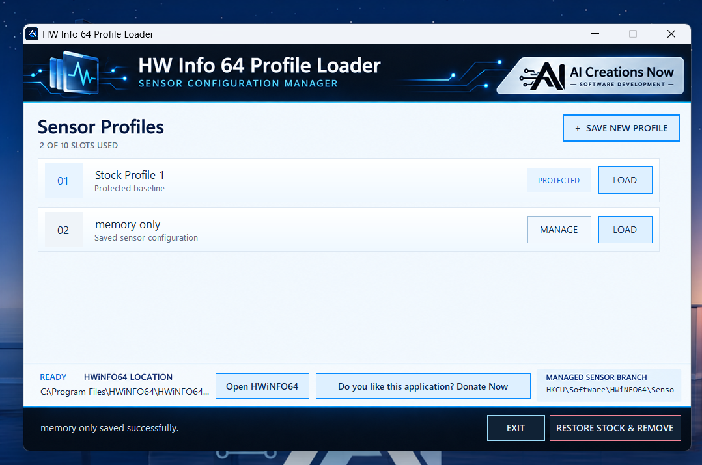

  

<h1 align="center">HW Info 64 Profile Loader</h1>

**Save and switch HWiNFO64 sensor layouts on Windows.** This independent companion from AI Creations Now Software Development keeps a protected starting configuration and a library of named profiles.

  <a href="https://download.aicreatenow.com/software/hwinfo64loader.exe"><strong>Download free for Windows</strong></a> · <a href="https://aicreatenow.com/hwinfo64loader.html">Product page and setup guide</a> · <a href="SUPPORT.md">Support</a>

  

## Features

- Ten profile slots: one protected stock configuration and nine custom profiles.
- Save, load, rename, update and remove custom sensor layouts.
- Detect installed or portable HWiNFO64 copies, with manual executable selection when needed.
- Close HWiNFO64 normally before applying settings, then reopen the detected copy after a successful load.
- Store profiles locally and restore the protected stock configuration when needed.

## Requirements and setup

Use Windows 11 x64 with a separately obtained HWiNFO64 installation or portable copy. Administrator permission may be required. Save and load profiles under the same Windows user account.

1. Download [hwinfo64loader.exe](https://download.aicreatenow.com/software/hwinfo64loader.exe) and prepare your complete sensor view in HWiNFO64.
2. Run the portable loader and capture **Stock Profile 1**.
3. Create additional layouts in HWiNFO64 and save each one through the loader.
4. Choose a saved profile when you want to switch layouts.

The companion manages saved sensor settings; HWiNFO64 performs the monitoring and logging.

## Download and support

**Published version: 1.8.3.** The utility is completely free. No donation, subscription or activation key is required. [Optional support through Stripe](https://buy.stripe.com/fZueVf63VeVG8kc4VM5kk09) supports development and customer service; it does not unlock features or purchase a HWiNFO license.

For product help, see [Support](SUPPORT.md) or email [info@aicreatenow.com](mailto:info@aicreatenow.com).

## Practical guide and release notes

[Getting started and common questions](GETTING-STARTED.md) · [GitHub release notes](https://github.com/aicreatenowdom/hwinfo64-sensor-layout-profile-loader/releases) · [Support](SUPPORT.md)

GitHub's **Code → Download ZIP** contains this repository's documentation and artwork. Get the Windows application through the [official product page](https://aicreatenow.com/hwinfo64loader.html).

## Source and licensing

This repository contains documentation for proprietary software. Application source code is not included. Obtain the application and its applicable terms through the official product page.

AI Creations Now develops and supports this companion independently. It is not affiliated with or endorsed by the HWiNFO developer. HWiNFO64 must be obtained separately and remains subject to its own license.
